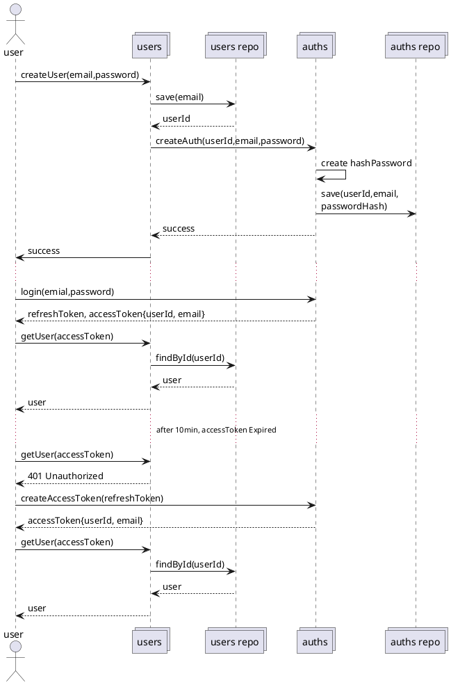

# Authentication

-   인증은 RefreshToken과 AccessToken 구조
-   RefreshToken 만료는 30일 AccessToken은 10분

## UserID

email은 유니크하기 때문에 userId로 사용해도 될 것 같다.
그러나 email은 사용자와 다르다.\
사용자는 email을 변경할 수 있다. 그러니 userId를 사용해야 한다.
또 oathemail은 중복될 수 있는데

## RefreshTable 구조

```javascript
key = refreshToken
value = {
    userId: 'string',
    email: 'string'
}
```

## AccessToken 구조

```javascript
const accessToken = {
    userId: 'string',
    email: 'string'
}
```


