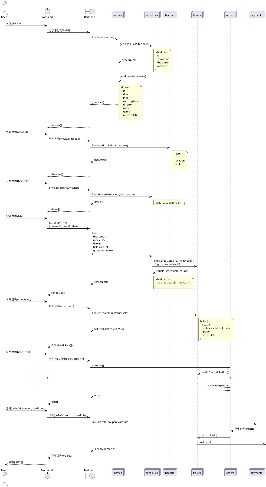

# Buying Tickets

https://plantuml.com/ko/sequence-diagram

actor : user
goal : 사용자가 영화 티켓을 구매한다.
preconditions : 사용자는 회원 가입 및 로그인 상태다.
main flow:

1.  사용자가 현재 상영중인 영화를 선택한다.
    -   영화 목록은 주간 순위, 월간 순위, 개봉일자로 정렬된다.
    -   영화를 선택하면 시놉시스, 사용자 후기 등 상세 정보를 볼 수 있다.
    -   검색을 통해서 과거에 상영했던 영화를 볼 수 있다.
1.  극장을 선택한다.
    -   선택한 영화를 상영 중인 극장만 보여준다
    -   사용자의 현재 위치에서 가까운 극장을 추천한다.
    -   반경 5km의 모든 극장. 없으면 가장 가까운 극장 5개
    -   지역을 선택하면 해당하는 극장 전체를 보여준다.
    -   지역은 여러단계로 이루어진다. 극장 목록을 보여주는 것은 마지막 단계다.
1.  상영 시간을 선택한다.
    -   매진되어 좌석이 없는 시간은 흐리게 표현한다.
1.  좌석을 선택한다.
    -   좌석은 등급과 종류가 있다.(로얄석, 커플석)
    -   좌석을 선택하면 10분 동안 선점 상태가 된다. 결제를 하기 전에 다른 사용자가 티켓을 구매하는 것을 막는다.
1.  결제한다.
    -   카드결제는 PaymentGateway 서비스를 사용한다.
1.  완료

    -   결제까지 성공하면 구매한 티켓 정보를 보여준다.

### 메소드를 weeklyRanking로 해도 될까?

이것은 weekly를 속성으로 볼 것인가? 대상으로 볼 것인가?
여기서는 속성으로 판단했다.
ranking은 영화 외에도 극장, 연령 등 다양하다.
ranking('weekly','movie') 이와 같이 확장될 수 있다.

###

TheatersService는 scheduleRepo을 포함한다.
`const theaters = schedule.findTheatersByMovie(movieId)` 를 해야 한다.

###

ScheduleService는 TicketsRepo를 포함해야 한다.
회차 당 남은 티켓수를 보여줘야 한다.

###

TicketsService의 데이터는
영화수*극장수*좌석수*회차*상영기간
만큼 생성된다. 엄청나게 많은 데이터다.

###

back <-- orders: 주문 정보(orderId)
orderId 리턴할 때 포인트/쿠폰 등 결제 관련 정보도 함께 리턴한다.
PointService, CouponService 로 나눌 것인가?
둘은 나누는 것이 좋다. 각각은 성격이 다른 entity이다.

###

이벤트인가? 메소드인가?
티켓이 업데이트 됐다는 정보는 이벤트로 했다. Statistics에서 사용한다.
PaymentService는 OrderService와 밀접한 관계가 있어서 직접 호출했다.
그러나 티켓 입장에서는 어떤 서비스에 업데이트 해야 하는지 모른다.
Order와 Ticket도 밀접한 관계가 있기 때문에 직접 호출했다.

