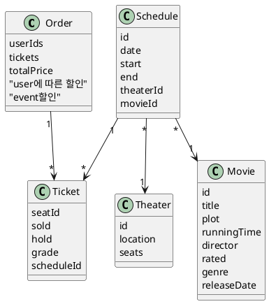

# Classes

note left
강하게 결합하는 것이 옳은가?
각각의 연관을 최대한 끊는 것이 옳은가?
movie를 상영하는 극장을 찾기 위한 방법은 뭔가?
movieId로 극장을 탐색하는가?
movie에 theaters를 두는가?

스케쥴을 추가할 때 batch를 지원하는 서비스는 어찌하나

금액Price object 반영, 포인트가 금액 대신인 경우도 있다 혼합되면 어쩔? 엔터프라이즈 516p
end note
note right
자유석은 특별한 티켓이다.
이것을 추가하게 되면 어떻게 되는지 보여준다.
end note

note right
theater.seats는 value인가 entity인가?
entity라면 theater가 aggregate root다
seat는 entity다 id로 관리되어야 하는 각각이 유니크한 속성이다.
end note

note right
기본이 되는 entity는 보통 다른 aggregate의 요소가 된다.
여기서 기본은 먼저 존재해야 하는 것.
Theater, Movie가 없으면 Schedule 등은 존재할 수 없다.
혹은 Schedule은 응용서비스의 한 종류로 해석할 수 있다.
end note

Knock at the Cabin
R1 hr 40 minFebruary 3, 2023
While vacationing at a remote cabin, a young girl and her parents are taken hostage by four armed strangers who demand that the family make an unthinkable choice to avert the apocalypse. With limited access to the outside world, the family must decide what they believe before all is lost.
Directed By:
M. Night Shyamalan
Rated:
R
Running Time:
1 hr 40 min
Genre:
Mystery & Thriller & Drama
Release Date:
February 3, 2023
