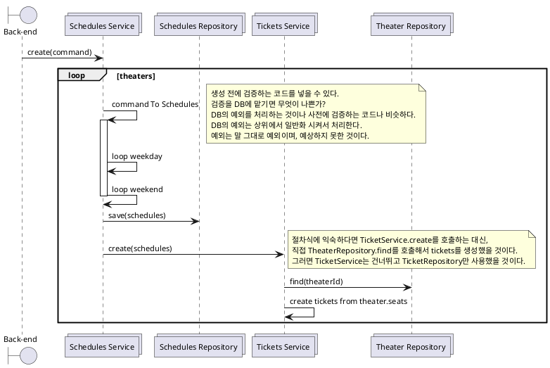

# Register Schedules

actor : admin
goal : 관리자가 영화 상영 일정을 등록한다.
preconditions : 영화는 등록된 상태다.
main flow:

1. 상영할 영화를 선택한다.
2. 극장을 선택한다.
    - 극장은 한 번에 여러개를 선택한다.
3. 상영기간을 선택한다.
    - 상영기간은 선택한 모든 극장에 동일하게 적용한다.
4. 회차를 등록한다.
    - 회차는 평일과 주말을 다르게 지정할 수 있다.
    - 특정 날짜를 예외적으로 지정할 수 있다.

> 특정 날짜는 예외적으로 지정할 수 있다는 조건은 고객과 협의해서 스케쥴 등록 후 수정하는 것으로 변경했다.
>
> 등록을 하면 theater.seats를 읽어서 tickets생성해야 한다.

> 개발 초기임에도 register schedules는 low-level에 집중한 그림을 그린다.
> 요구사항 자체는 간단하나 그것을 처리하는 일이 복잡하다고 판단한 것이다.
> 정해진 것은 없다. 필요한 것을 필요한 만큼 하면 된다.

```json
{
    movieId,
    theaterIds[],
    screeningPeriod: { start: 20201101, end: 20210131 },
    rounds: {
        weekday: [
            { start: 0900, end: 1100}
            { start: 1130, end: 1330}
            { start: 1400, end: 1600}
        ]
        weekend: [
            { start: 0700, end: 0900}
            { start: 0930, end: 1130}
            { start: 1200, end: 1400}
            { start: 1430, end: 1630}
        ]
    }
}
```


