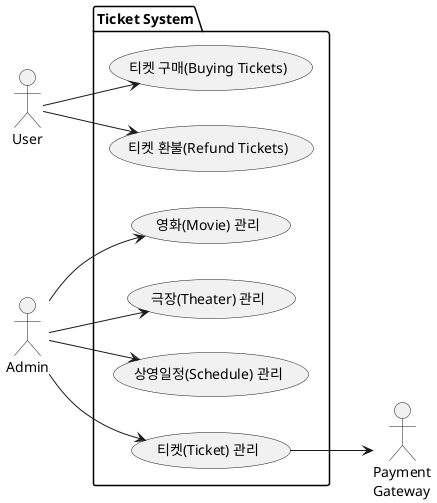

# Use Cases

https://plantuml.com/ko/use-case-diagram

```plantuml
@startuml
left to right direction

actor User as user
actor Admin as admin
actor "Payment\nGateway" as payment

package "Ticket System" {
  usecase "티켓 구매(Buying Tickets)" as buy
  usecase "티켓 환불(Refund Tickets)" as refund
  usecase "영화(Movie) 관리" as movie
  usecase "극장(Theater) 관리" as theater
  usecase "상영일정(Schedule) 관리" as schedule
  usecase "티켓(Ticket) 관리" as ticket
}

user -->  buy
user -->  refund
admin -->  movie
admin -->  theater
admin -->  schedule
admin -->  ticket
ticket --> payment
@enduml
```
